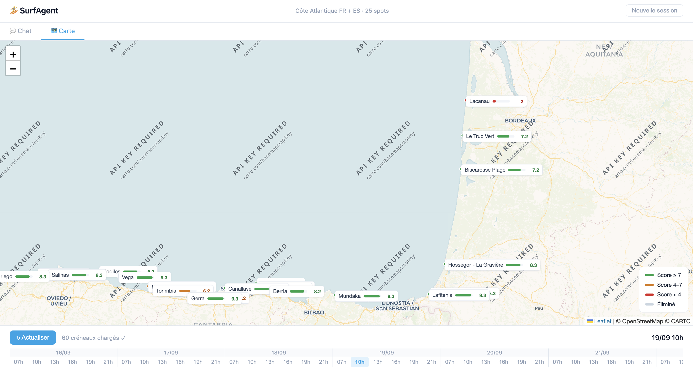

# SurfAgent

A personal surf-forecasting agent that scores conditions across 25 spots on the
French and Spanish Atlantic coast, and tells you where to paddle out — through a
conversational agent, a map, or a daily newsletter.

Built end-to-end as a side project: data pipeline, scoring engine, conversational
agent and front-end.

## What it does

- **Scores 25 spots** from live marine-forecast data (Stormglass API), ranked by
  how good the surf actually is at a given hour.
- **Custom scoring engine** — combines swell direction, period and size, then maps
  the result against a per-spot wind window (offshore / cross / onshore). A clean
  swell with the wrong wind still scores low, because that's how it works in the water.
- **Conversational agent** (Mistral tool-calling): ask "where should I surf tomorrow
  morning?" in plain language — it fetches, scores, and explains its pick.
- **Interactive map** (Leaflet) with spots colour-coded by score (green ≥7, orange 4–7, red <4).
- **Daily newsletter** (SendGrid): the ranked spots delivered every morning, written
  in the voice of a laid-back cartoon surfer.

## Architecture

| File | Role |
|------|------|
| `01_fetcher.py` | Pulls marine-forecast data from Stormglass |
| `agent_core.py` | Scoring logic and agent tools — the brain |
| `forecast.py` | Shared forecast cache |
| `04_api.py` | Minimal FastAPI server exposing the agent |
| `05_newsletter.py` | Daily ranked-spots email via SendGrid |
| `index.html` | Leaflet map front-end (chat + map views) |
| `debug_scoring.py` | Standalone calibration tool: prints the full score breakdown per spot, used to tune and validate the scoring logic |
| `DB spots.csv` | The 25 spots — coordinates and ideal wind direction |

## Stack

Python · FastAPI · Stormglass API · Mistral (tool-calling) · SendGrid · Leaflet

## Running it

1. Copy `.env.example` to `.env` and fill in your API keys (Stormglass, Mistral, SendGrid).
2. Install dependencies: `pip install -r requirements.txt`
3. Run the API: `uvicorn 04_api:app --reload`
4. Open `index.html` for the map and chat interface.

---

*A personal project — built to actually decide where to surf on the Basque and Landes coast.*
